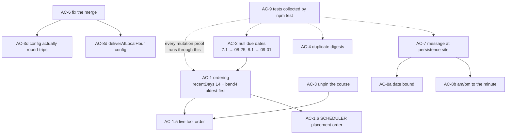

# Acceptance criteria — nudge delivery, coursework ordering, config merge, guards

<!--
WHAT:       Verifiable, binary acceptance criteria for the nine owner-requested changes of
            2026-09-03 (ordering boundary + old-backlog direction, null due dates, course
            unpinning, duplicate digests, symbols guard, config merge, nudge message single
            source, nudge query/time format, committed tests).
WHY:        The previous round shipped on self-gathered evidence and an independent verifier
            refuted it (docs/verify/nudge-delivery-loop1.md). Its root cause is recorded in
            .claude/accuracy-log.md: "I fixed the site I was looking at, not the site the data
            flows through", and "a unit test on the new function is not evidence the
            user-visible behaviour changed".
SUPERSEDES: nothing.
SUPERSEDED-BY: nothing — current.
EVIDENCE:   docs/verify/nudge-delivery-loop1.md (independent verifier, head 826d310);
            .claude/accuracy-log.md; live queries and command output cited inline below.
-->

Author: independent AC subagent. No implementation was performed while writing this.
Repo `/home/user/journey-voice`, branch `claude/huddle-journey-integration-xokgv1`,
base head `3e4d630` (`git log --oneline -1`). Every "OBSERVED" line below was produced by a
command run in this session and is quoted verbatim; anything not observed is labelled
INFERENCE.

## How to read this

Each AC is `Given <context>, when <action>, then <observable outcome>` plus:

- **TIER** — 1 = decides a gate/score/placement, or admits model/inferred output into a stored
  claim (needs an independent verifier + mutation proof); 2 = ordinary logic; 3 = prose.
- **CHECK** — the exact command, query or file assertion that makes the AC binary.
- **REGRESSION** — what must be re-run to prove the AC has not silently rotted later.

**Standing rule for every AC in this document (from `.claude/accuracy-log.md`):** a test that
calls the new function directly is NOT sufficient evidence. Each AC's CHECK must exercise the
path the user's data actually takes — the persistence site and the read sites, not only the
derivation site. Where an AC can be satisfied by a unit test alone, it says so explicitly and
adds a second CHECK against the live path.

---

## Ground truth established before writing these ACs

| # | Observation | Source |
|---|---|---|
| G1 | `npm test` = `node --experimental-strip-types --test src/utils/*.test.ts`. Running it now: `# tests 11 / # suites 2 / # pass 11`. Both suites are in `src/utils/`. | `package.json`; `npm test` output |
| G2 | `supabase/functions/_shared/task-dedup.test.ts` exists (5938 bytes) and is **never executed** by `npm test` — the glob does not reach it. | `ls -la`, and G1's suite count of 2 |
| G3 | `node scripts/undef-check.mjs` with no args → prints nothing, `EXIT=0`. | command output |
| G4 | `node scripts/undef-check.mjs supabase/functions/_shared/nudges.ts` → `_shared uses=0 missing=none`, `EXIT=0` — a green pass on a file it did not examine. | command output |
| G5 | `node scripts/undef-check.mjs supabase/functions/execute-tool/index.ts` → `uses=3 missing=failures`, `EXIT=1`. The only `failures` occurrences are the English word in comments at `:1514` and `:1644`. | command output + `grep -n "\bfailures\b"` |
| G6 | Live `user_scheduling_prefs` for `a3378f93-…`: `config` keys are exactly `categoryMappings, contextRules, customAIInstructions, timeWindows, workingHours, workloadBalance`. `config->'dedup'`, `->'nudges'`, `->'assignments'` are all `null`. | Supabase MCP `execute_sql` |
| G7 | `mergeSchedulingConfig` (`src/config/schedulingRules.ts:287-308`) returns an object literal naming 8 fields. `priorityBoost` is declared in the `SchedulingConfig` interface (`:68`) and in `DEFAULT_SCHEDULING_CONFIG` (`:242`) but is **not** among the returned fields, so the merge cannot preserve it. `dedup` is not in the interface at all yet is read by edge functions. | file read; `grep -rn "priorityBoost"` |
| G8 | `config.dedup` is consumed server-side only — `_shared/task-dedup.ts:19`, `execute-tool/index.ts:882,1354`. No client type, no UI. Same shape as `nudges` and `assignments`. | `grep -rn "dedup"` |
| G9 | A weekly-cadence due-date inference **already exists** at `nightly-assignment-sync/index.ts:143-162` (`inferMissingDueDates`), tags rows `_due_date_inferred: true`, and logs each inference. AC-2 is therefore an EXTEND, not a new subsystem. | file read |
| G10 | `nightly-assignment-sync/index.ts:128-130` pins `ACTIVE_COURSE_IDS` to one literal uuid and passes it at `:171`. `_shared/nexus.ts` contains no uuid literal. | file read; verifier §C5 |
| G11 | `DailyReviewModal.tsx:279` already formats placement time as `hour:'numeric', minute:'2-digit', hour12:true` — the repo's existing am/pm convention — while rendering `venue_nudge.message` verbatim at `:280`. | file read |
| G12 | `courseworkOrder` has exactly two importers: `execute-tool/index.ts:8` (used at `:2709` and for the `band` label at the `enriched` map) and `nightly-schedule-builder/index.ts:25` (used at `:788` `deadlineTriageOrder`, applied at `:793-795`, `:1354`, `:1366`). Changing its defaults changes BOTH what Iris says and where the scheduler puts work. | `grep`, file reads |

---
## AC-1 — Ordering: `recentDays` 30 → 14, and band 4 sorts OLDEST FIRST

**Blast radius before anything else (this is Tier 1 and both consumers move together).**
`courseworkOrder` has exactly two importers (G12). Changing `DEFAULT_RECENT_OVERDUE_DAYS` and
band 4's direction changes (a) what `list_pending_assignments` tells the user, and (b) the order
`nightly-schedule-builder` PLACES coursework into the week (`deadlineTriageOrder`, applied at
`:793-795`, `:1354`, `:1366`). An AC that only proves the tool's output is half a proof.

### OBSERVED — the real MIT set, recomputed for both boundaries

`now = 2026-09-03T12:00Z`; 7.1/8.1 carry the AC-2 inferred dates (2026-08-25, 2026-09-01):

```
8.1 Capstone   due=2026-09-01 overdue=2.5d   band@14=2  band@30=2
7.1            due=2026-08-25 overdue=9.5d   band@14=2  band@30=2
6.1            due=2026-08-18 overdue=16.5d  band@14=4  band@30=2
5.1            due=2026-08-11 overdue=23.5d  band@14=4  band@30=2
4.1            due=2026-08-04 overdue=30.5d  band@14=4  band@30=4
3.1            due=2026-07-28 overdue=37.5d  band@14=4  band@30=4
2.1            due=2026-07-21 overdue=44.5d  band@14=4  band@30=4
1.1            due=2026-07-14 overdue=51.5d  band@14=4  band@30=4
```

**INTERPRETATION — the owner's stated expected list and `recentDays=14` disagree about 6.1.**
The owner wrote the expected result as `8.1, 7.1, 6.1, then 1.1, 2.1, 3.1 …`. Under
`recentDays=14` on today's date 6.1 is 16.5 days overdue, so it falls to band 4 and — under the
new OLDEST-FIRST direction — becomes the **last** row, not the third. Placing 6.1 third requires
`recentDays ≥ 17`. I searched for a `now` that satisfies the literal list under a 14-day
boundary and there is none: making 6.1 recent (`now ≤ 2026-09-01`) simultaneously makes 8.1
not-yet-overdue (band 1). **This is unresolved and is RISK-1 below. Do not pick one by
assumption — it changes the golden fixture the whole AC is scored against.** The ACs below are
written to the SHAPE the owner described (recent misses newest-first, then old backlog
oldest-first) with `now` pinned, so they are decidable either way once the owner answers.

### AC-1.1 — the boundary constant moves and is config-overridable
**Given** `_shared/nexus.ts` exports `DEFAULT_RECENT_OVERDUE_DAYS = 30`,
**when** the change lands,
**then** that export is `14`, and a caller passing `recentDays` (or
`config.assignments.recentOverdueDays`) still overrides it.
- **TIER 2.** A constant swap; the behaviour it drives is covered by 1.2–1.6.
- **CHECK:** `grep -n "DEFAULT_RECENT_OVERDUE_DAYS" supabase/functions/_shared/nexus.ts` shows
  `= 14`; plus a unit assertion that `courseworkBand({due_date:'2026-08-18'},{now:<2026-09-03>,
  recentDays:30})` is `2` while the same call with no `recentDays` is `4`.
- **REGRESSION:** the unit assertion above, run by `npm test` (see AC-9.2 — it must actually be
  collected, not merely committed).

### AC-1.2 — band 4 reverses to OLDEST FIRST; bands 1/2/3 do not move
**Given** four assignments in band 4 with due dates 2026-07-14, 07-21, 07-28, 08-04 and
`now = 2026-09-03T12:00Z`,
**when** they are sorted with `courseworkOrder({now})`,
**then** the output order is exactly `07-14, 07-21, 07-28, 08-04`; **and** the same test file
asserts band 1 and band 3 remain soonest-first and band 2 remains most-recent-miss-first.
- **TIER 1** — decides placement order in the nightly builder.
- **CHECK:** a committed unit test (AC-9) asserting all four band directions in ONE test, so
  reversing band 4 by flipping the shared `db - da` expression — which would silently reverse
  band 2 as well — fails immediately.
- **REGRESSION:** `npm test`. **Mutation proof required:** revert band 4 to newest-first, the
  named test MUST fail; revert band 2 to oldest-first, a DIFFERENT named test MUST fail. Two
  distinct failures, run via `scripts/mutate.sh` (anchors supplied from files, not shell args).

> **Adversarial note.** `courseworkOrder:297` currently reads
> `return ba === 1 || ba === 3 ? da - db : db - da;` — one expression serving bands 2 and 4
> together. The easy path is to flip that whole expression, which reverses band 2 too and still
> passes any test that only checks band 4. AC-1.2 exists specifically to make that fail.

### AC-1.3 — the exact-boundary case is decided explicitly, not by accident
**Given** an assignment due exactly `recentDays` days before `now` (delta = `-14 * 86400000` to
the millisecond),
**when** `courseworkBand` is called,
**then** it returns the band the owner chose (band 2 under the current `<=` reading), and a
committed test asserts BOTH sides of the boundary: `-14d + 1ms` and `-14d - 1ms` land in
different bands.
- **TIER 1** — one item crossing this boundary changes the head of the list and the order the
  scheduler places work.
- **CHECK:** unit test with three cases (exactly 14d, 14d−1ms, 14d+1ms) and an explicit comment
  naming which side the boundary is inclusive on.
- **REGRESSION:** `npm test`. **Mutation proof:** change `-delta <= recent` to `-delta < recent`
  (`nexus.ts:283`); the boundary test MUST fail.

### AC-1.4 — the comparator is a valid TOTAL ORDER (transitivity pinned)
**Given** the verifier's proof that the builder's composed comparator is intransitive — three
tasks `C1` (assignment, band 1, score 10), `C2` (assignment, band 4, score 90), `N`
(non-assignment, undated, score 50) produce `C1 < C2 < N < C1`, and six permutations of the same
three tasks yield **three different sorted orders** (verifier §C7),
**when** the ordering change lands,
**then** sorting those same three tasks is **permutation-invariant**: all 6 permutations produce
one identical output order.
- **TIER 1** — this is the difference between "the scheduler placed work in the owner's order"
  and "the scheduler placed work in the order Postgres happened to return rows".
- **CHECK:** a committed test that (i) builds a randomised set of ≥ 40 mixed
  assignment/non-assignment tasks spanning all five bands and both score branches, (ii) sorts
  every one of 200 random permutations with the **builder's actual comparator** (not
  `courseworkOrder` alone), and (iii) asserts all 200 results are byte-identical after mapping to
  ids. **Additionally** it must assert the comparator's own axioms directly over all ordered
  triples of a ~20-item fixture: antisymmetry (`cmp(a,b) === -cmp(b,a)`) and transitivity
  (`cmp(a,b)<=0 && cmp(b,c)<=0 ⇒ cmp(a,c)<=0`).
- **REGRESSION:** `npm test`. **Mutation proof:** reinstate the mixed-branch comparator exactly as
  it stands at `nightly-schedule-builder/index.ts:1352-1396`; the transitivity test MUST fail with
  a counterexample triple printed.

> **Adversarial note — this is the AC most likely to be gamed.** The permutation test alone can
> be satisfied by a stable sort over an already-nearly-sorted fixture. The explicit triple-wise
> axiom check is what makes it binary. A comparator that is merely "usually consistent" fails.
> Note also that the comparator under test must be the one the builder actually uses at
> `:1352-1396`, extracted so it is callable — testing `courseworkOrder` in isolation reproduces
> the exact mistake recorded in `.claude/accuracy-log.md` (the isolated function was never the
> broken thing).

### AC-1.5 — the tool's live output matches the pinned expectation
**Given** the deployed `list_pending_assignments` and the user's real Nexus data,
**when** it is invoked live for `a3378f93-d655-4913-b2fa-ca5b1d8020f1`,
**then** the returned rows, read top-down by their `band` label and title, match the order the
owner signs off in RISK-1 — recorded in this file as a literal expected list before the run, not
written down after seeing the output.
- **TIER 1.**
- **CHECK:** live invocation through `pg_net` (direct HTTPS to functions is blocked from this
  sandbox — the verifier's working method, §C4): `select net.http_post(url:='…/functions/v1/
  execute-tool', body:='{"toolName":"list_pending_assignments","userId":"a3378f93-…","args":{}}')`
  then read `net._http_response`. Paste the first 10 `{band, due_date, title}` rows into the
  verification report.
- **REGRESSION:** re-run the same invocation; ordering must be identical across two runs (this
  also re-proves AC-1.4 against real row order).

### AC-1.6 — the SCHEDULER's placement order changes too, and is observed
**Given** `courseworkOrder`'s defaults now differ,
**when** `nightly-schedule-builder` runs `{dryRun:true, singleDay:false}` for the real user,
**then** the run's logged assignment tier ordering reflects the new bands, and the AC report
states the before/after placement order for the 8 MIT items.
- **TIER 1** — this is the "fixed the site I was looking at, not the site the data flows
  through" trap from the accuracy log, applied to ordering.
- **CHECK:** invoke via `pg_net` with `{"userId":"a3378f93-…","dryRun":true}` (documented
  zero-write mode, proven safe by the verifier §F5.f), then read the function logs / the returned
  body for the tier ordering. A dry run that does not surface the order is not evidence — add the
  log line if it is missing.
- **REGRESSION:** the dry-run invocation, re-run after any later change to `_shared/nexus.ts`.

---
## AC-2 — Null due dates for MIT 7.1 and 8.1: fix the data AND share the inference at read time

**EXTEND, DO NOT DUPLICATE (G9).** The weekly-cadence inference already exists as
`inferMissingDueDates` at `nightly-assignment-sync/index.ts:143-162`. It already anchors on the
latest dated assignment, already derives the sequence number from the `N.1` title pattern,
already refuses to place an item it cannot sequence (`s <= anchorSeq` → returns unchanged), and
already tags `_due_date_inferred: true`. The owner's "double down" is to MOVE that function into
`_shared/nexus.ts` so the tool sees it too — **not** to write a second one. Two implementations
of the same cadence rule is precisely the divergent-duplication pattern the accuracy log names
as recurring.

### AC-2a — the repo data is actually fixed
**Given** Nexus `content.assignments` rows for MIT 7.1 and the 8.1 Capstone with
`due_date IS NULL`,
**when** the data fix is applied,
**then** both rows carry real `due_date` values in Nexus, and re-reading them returns those
dates.
- **TIER 1** — a written claim about a deadline; it drives placement.
- **CHECK:** read back through the same path the app uses —
  `GET {NEXUS_API}/api/d1/assignments?owner=a3378f93-…&course_id=8036ebab-…` (or the
  `db-query.yml` / Actions fallback if the sandbox cannot reach Azure) — and paste the two rows'
  `id, title, due_date`. **A write receipt is not evidence; the read-back is.**
- **REGRESSION:** the same read-back, re-run after the next `nightly-assignment-sync` execution,
  to prove the sync does not re-null them.

### AC-2b — the inference is SHARED, with exactly one implementation
**Given** `inferMissingDueDates` currently lives only in `nightly-assignment-sync`,
**when** the change lands,
**then** the cadence inference is exported from `supabase/functions/_shared/nexus.ts`, the sync
imports it instead of defining it, and no second copy of the rule exists anywhere.
- **TIER 2.**
- **CHECK:** `grep -rn "inferMissingDueDates\|WEEK_MS\|weekly cadence" --include=*.ts supabase src`
  returns the definition in `_shared/nexus.ts` and IMPORT sites only — zero other function
  bodies. Assert the count of `function inferMissingDueDates` occurrences is exactly 1.
- **REGRESSION:** the same grep, as a committed guard (the same shape as
  `check-nudge-single-source.mjs` in AC-7).

### AC-2c — the inference is DETERMINISTIC
**Given** the same input list of assignments,
**when** the inference runs twice, in different array orders, in different timezones
(`TZ=UTC` and `TZ=America/New_York`),
**then** it produces byte-identical `due_date` values every time.
- **TIER 1** — an inferred date becomes a stored claim about a deadline.
- **CHECK:** committed unit test: build the real 6-dated + 2-undated MIT fixture, run the
  inference over 20 shuffles of the input and under both `TZ` values, assert one distinct result
  set. Assert the concrete expected values (`7.1 → 2026-08-25`, `8.1 → 2026-09-01`) as literals.
- **REGRESSION:** `npm test`. **Mutation proof:** change the anchor from "latest dated" to
  "first in array"; the shuffle test MUST fail.

### AC-2d — the inference NEVER overwrites a real date
**Given** an assignment that already has a `due_date`,
**when** the inference runs,
**then** its `due_date` is returned unchanged and it is NOT marked inferred — including when the
existing date CONTRADICTS the cadence (e.g. 5.1 dated 2026-08-30 rather than 08-11).
- **TIER 1.**
- **CHECK:** committed unit test with a deliberately cadence-violating real date; assert the
  output date `=== ` the input date and the inferred marker is absent. Additionally assert
  object identity or a deep-equal on every dated row.
- **REGRESSION:** `npm test`. **Mutation proof:** remove the `if (a.due_date) return a;` guard at
  `:155`; the test MUST fail.

> **Adversarial note.** The easy path is `due_date: a.due_date ?? inferred`, which is correct
> today but silently overwrites `''` or `'null'` string values, and re-derives on every read.
> The test must use a real date that disagrees with the cadence so "recomputed anyway" is caught.

### AC-2e — an inferred date is VISIBLY MARKED as inferred, everywhere it surfaces
**Given** 7.1 and 8.1 whose dates came from the cadence rule rather than the course,
**when** they appear in `list_pending_assignments`' response, in a created task, and in anything
Iris says about them,
**then** each carries an explicit inferred flag AND the user-facing text distinguishes it from a
published deadline (e.g. "estimated from the weekly cadence", never a bare date).
- **TIER 1** — this is model/heuristic output entering a stored claim the user acts on. This is
  the AC that stops journey telling the owner "8.1 is due Sept 1" as if the course said so.
- **CHECK:** three separate assertions, one per surface:
  1. Tool response: the live `pg_net` invocation (AC-1.5) returns `due_date_inferred: true` (or
     equivalent) on exactly those two rows and on no others.
  2. Stored task: `select id, title, due_date, scheduling_context, tags from public.tasks where
     user_id='a3378f93-…' and assignment_id in (<7.1 id>,<8.1 id>)` shows the marker persisted.
  3. Text: grep the composed agent/nudge text for the qualifier; assert a bare
     "due September 1" form does not appear for an inferred row.
- **REGRESSION:** re-run all three. **Mutation proof:** strip the marker from the shared
  function; assertion 1 MUST fail, and assertion 2 MUST fail independently (proving the marker is
  actually persisted, not just computed).

> **Adversarial note.** The easy path marks it in the shared function and never plumbs it to the
> task row or the sentence — which is exactly the C1c failure again (derived in one place, read
> in another). Two of the three assertions above are downstream of the derivation on purpose.

### AC-2f — belt AND braces are CONSISTENT
**Given** AC-2a has fixed the data and AC-2b has added read-time inference,
**when** both are in place,
**then** the read-time inference is a **no-op for those rows** (the real date wins per AC-2d),
and the two consumers — `list_pending_assignments` and `nightly-assignment-sync` — report the
SAME due date for 7.1 and 8.1.
- **TIER 1.**
- **CHECK:** live tool invocation (AC-1.5) and a `nightly-assignment-sync` dry run, compared
  side by side in the report; the two dates must be equal AND equal to the Nexus value from
  AC-2a's read-back.
- **REGRESSION:** the same paired comparison.

---

## AC-3 — Unpin the course in `nightly-assignment-sync`

### AC-3a — no course uuid literal remains in the file
**Given** `nightly-assignment-sync/index.ts:128-130` hardcodes
`'8036ebab-d1bc-460b-92b0-c45fb312a12e'`,
**when** the change lands,
**then** the file contains **no** course uuid literal at all.
- **TIER 2** (the literal's removal); the behaviour it changes is AC-3b/3c, which are Tier 1.
- **CHECK:** `grep -nE "[0-9a-f]{8}-[0-9a-f]{4}-[0-9a-f]{4}-[0-9a-f]{4}-[0-9a-f]{12}"
  supabase/functions/nightly-assignment-sync/index.ts` returns **only** `MIT_PROGRAM_ID`
  (`:120`) if that is deliberately retained, and NO course id. If `MIT_PROGRAM_ID` is also to go,
  the grep must return nothing. Record which was chosen and why.
- **REGRESSION:** add that grep to the committed guard script so a future paste of an id fails.

### AC-3b — the sync's scope now MATCHES the tool's scope
**Given** the verifier measured the tool admitting 2 courses (29 rows) while the sync ingests 1,
so 13 "AI and Business Strategy" items are reported as pending that the scheduler will never
place,
**when** the change lands,
**then** for the same user at the same instant, the SET of course ids the sync ingests is
**equal** to the set `resolveActiveCourseIds` returns for the tool — and the count of reported
pending items with no possible task is **zero**.
- **TIER 1** — it decides which work is ingested and therefore what can ever be placed.
- **CHECK:** two observations compared in the report:
  1. Tool: live `pg_net` invocation, group returned rows by `course`, list distinct courses.
  2. Sync: `nightly-assignment-sync` in a dry-run/inspection mode, logging the resolved course
     id set (add the log line if absent).
  Assert set equality explicitly, printing both sets. Then query
  `select count(*) from public.tasks where user_id=… and assignment_id is not null` against the
  tool's reported ids and assert every reported assignment id has, or can have, a task.
- **REGRESSION:** re-run both after the next real nightly run.

### AC-3c — unpinning does NOT flood the board
**Given** the pin's stated purpose (`:123-127`) is flood prevention — 546 open assignments exist
in Nexus across MIT + EMBA, mostly aged backlog,
**when** the sync runs unpinned against real data,
**then** the number of tasks it would create is bounded and reported BEFORE any write, and the
report states the number for both the old pinned scope and the new inferred scope.
- **TIER 1** — the failure mode here is a live board flooded with hundreds of 2025 items, and it
  is not cheaply reversible.
- **CHECK:** a dry run FIRST (`dryRun` / `plannedInserts` are already computed at `:112-113`),
  reporting `plannedInserts.length` under both scopes. Only after the owner sees those two
  numbers may a real run happen. Assert `plannedInserts.length` under the new scope is within the
  owner-agreed bound.
- **REGRESSION:** the dry run, before every subsequent scope change.

> **Adversarial note — the trap that will bite the easy path.** `fetchNexusAssignments` in
> `_shared/nexus.ts:330-332` issues **one request per `course_id`** and, when `courseIds` is
> empty or absent, **one unfiltered request for everything**. `resolveActiveCourseIds` infers
> from the assignments it is GIVEN. So the naive edit — replacing `ACTIVE_COURSE_IDS` with
> `config.assignments.activeCourseIds` — yields `undefined` on the live config (G6: the key is
> null), which fetches EVERY course and scopes nothing: a 546-row flood, exactly what `:123-127`
> exists to prevent. The correct shape is fetch-unscoped-then-`scopeToActiveCourses`, or resolve
> the ids first and then fetch. **AC-3c fails the naive edit by construction, which is its
> purpose.**

### AC-3d — the scope is user-changeable, not merely un-hardcoded
**Given** the repo's standing rule that a behaviour-affecting value must be user-changeable,
**when** the pin is removed,
**then** `config.assignments.activeCourseIds` / `excludeCourseIds` / `activeCourseEraDays`
actually reach the sync, and setting them changes its resolved set.
- **TIER 1.**
- **CHECK:** set `config.assignments.excludeCourseIds = ['<the MIT course id>']` for a test user
  via SQL, dry-run the sync, observe the course dropped from the resolved set; then restore. The
  write must go through the **UI save path** if one exists, because AC-6 shows the merge deletes
  the namespace — a SQL-only write proves the reader, not the round trip.
- **REGRESSION:** re-run after AC-6 lands; the value must SURVIVE a Settings save (this is the
  cross-check between AC-3 and AC-6).

---

## AC-4 — Duplicate digests: all three vectors closed

The verifier found three independent vectors (§F4). An AC per vector, because closing one does
not close the others, and the easy path closes only vector 1.

### AC-4a — the delivery block does not fire on a single-day/manual rebuild
**Given** `FocusView.tsx:642` ("Reschedule today") and `DailyReviewModal.tsx:366` ("Confirm
schedule") both invoke the builder with `singleDay: true`, and the delivery block at
`nightly-schedule-builder/index.ts:2118` is not gated on it,
**when** a user taps either button,
**then** **no** additional digest row is queued.
- **TIER 1** — it decides whether the user is notified, and how often.
- **CHECK:** `select count(*) from scheduled_notifications where user_id='a3378f93-…' and
  metadata->>'source'='nudges' and scheduled_for::date = current_date;` recorded before, then
  invoke the builder via `pg_net` with `{"userId":"a3378f93-…","singleDay":true}` (a REAL run,
  not dryRun — dryRun skips the block and proves nothing), then re-count. **The count must be
  unchanged.**
- **REGRESSION:** repeat the invoke-and-count three times in a row; the count must stay flat.

### AC-4b — the computed `key` actually suppresses a re-delivery
**Given** `nudges.ts:117,141` compute a stable `key` (`venue:<taskId>:<localDate>`) that
`deliverNudgeDigest` writes into the payload and never uses,
**when** the same nudge would be delivered twice for the same local date,
**then** the second delivery is suppressed **by that key**, and the suppression is observable.
- **TIER 1.**
- **CHECK:** call the real `deliverNudgeDigest` twice with the same nudge set against the live
  table (as a test user), then
  `select id, scheduled_for, metadata->'nudges' from scheduled_notifications where
  metadata->>'source'='nudges' order by created_at desc limit 5;` — exactly ONE row. Then call it
  with a DIFFERENT key (change `localDate`) and assert a second row IS created, proving the
  suppression is keyed and not a blanket "only ever one".
- **REGRESSION:** `npm test` for the key-composition unit, plus the live two-call check.
  **Mutation proof:** remove the suppression; the two-call check MUST produce 2 rows.

> **Adversarial note.** "Gate on `!singleDay`" (AC-4a) alone will make AC-4b's live check pass by
> accident if the check is run through the builder. AC-4b must call `deliverNudgeDigest`
> DIRECTLY, twice, so it tests suppression rather than the gate.

### AC-4c — the purge actually purges (it currently filters on columns that do not exist)
**Given** `nightly-schedule-builder/index.ts:576-579` deletes with `.eq('status','pending')` and
`.gte('send_at', …)`, and the live `scheduled_notifications` table has **neither** column (its
columns are `id, user_id, task_id, notification_type, title, body, scheduled_for, delivered_at,
failed_at, failure_reason, created_at, processing_at, processing_instance, queued_during_quiet,
original_scheduled_for, metadata`), so PostgREST rejects the filter and the surrounding `try`
swallows it as "non-fatal",
**when** the purge runs,
**then** it uses real columns (`scheduled_for`, `delivered_at is null`), it deletes the rows it
claims to, and a failure is **logged as an error with the PostgREST message**, not silently
swallowed.
- **TIER 1** — a broken purge is the safety net that would have absorbed AC-4a.
- **CHECK:** three parts.
  1. Column reality: `select column_name from information_schema.columns where
     table_name='scheduled_notifications';` — every column named in the delete must appear.
  2. Behaviour: seed 2 pending rows for today via SQL, run a single-day rebuild, re-query — both
     gone.
  3. Loudness: temporarily point the filter at a nonexistent column and confirm the log now
     contains the PostgREST error text rather than a bare "non-fatal" line.
- **REGRESSION:** part 2, re-run. **Mutation proof:** restore `.eq('status','pending')`; part 2
  MUST fail (rows remain).

> **Adversarial note.** The `catch` at `:581` currently converts a schema error into a warning,
> which is how this survived. An AC that only asserts "the delete call is present" passes today.
> Part 2 asserts ROWS ARE GONE — that is the only binary form.

### AC-4d — no accumulation against an undelivered digest
**Given** nothing checks `delivered_at is null` before inserting,
**when** yesterday's digest was queued and never delivered,
**then** today's run does not add a second undelivered digest for the same user; the report
states the chosen policy (supersede vs skip) and the query proving it.
- **TIER 2.**
- **CHECK:** seed an undelivered `source='nudges'` row dated yesterday, run the builder, then
  `select id, scheduled_for, delivered_at from scheduled_notifications where
  metadata->>'source'='nudges' and delivered_at is null;` — assert the count matches the stated
  policy exactly (1 under supersede, 1 under skip; never 2).
- **REGRESSION:** the same seeded scenario.

---
## AC-5 — Symbols guard: `scripts/undef-check.mjs` made real and MUTATION-PROVED

Three defects, each observed this session (G3/G4/G5). Each gets its own binary AC because a
single "the guard works" AC is satisfiable by any one of the three fixes.

### AC-5a — no arguments is a LOUD FAILURE, not a silent pass
**Given** `node scripts/undef-check.mjs` currently prints nothing and exits `0` (G3),
**when** it is invoked with no file arguments,
**then** it prints an explicit error naming what it expected and exits **non-zero**.
- **TIER 1** — the guard decides whether a change is allowed to be called verified; a
  false green here is worse than no guard (this is the accuracy log's "treated a tool's SILENCE
  as a pass without confirming it had any input").
- **CHECK:** `node scripts/undef-check.mjs; echo "EXIT=$?"` → non-zero, with a message on
  stderr. Record the exact output.
- **REGRESSION:** the same one-liner, in the committed guard/CI step.

### AC-5b — the guard has a DEFAULT file set and covers the current symbols
**Given** the `required` list is a frozen snapshot of `06b0eba`'s symbols and contains none of
`deliverNudgeDigest`, `nextLocalHour`, `venueNudge`, `overflowNudge`, `composeDigest`,
`buildVenueNudgeMessage`, `courseworkBand`, `resolveActiveCourseIds` (G4 shows it returns
`uses=0 missing=none` on `nudges.ts`),
**when** the guard runs with no arguments (per AC-5a it must still be given something to check),
**then** it checks a **declared default set of files** covering every edge function touched by
this work, and its symbol list is derived from the files' own imports/exports rather than
hand-maintained — or, if hand-maintained, it fails when a file uses an imported name absent from
the list.
- **TIER 1.**
- **CHECK:** run the guard on `_shared/nudges.ts` and assert `uses` > 0 (today it is `0`). Assert
  the printed `uses` count for each default file is non-zero — **a file reporting `uses=0` must
  be treated as "not checked" and fail**, since that is exactly the false green in G4.
- **REGRESSION:** the same run; assert no file reports `uses=0`.

> **Adversarial note.** The easy path appends the six new names to the hardcoded `required`
> array. That passes a naive AC and rots on the very next commit — the identical failure this
> guard already had. AC-5b's `uses=0 ⇒ fail` clause is what makes a stale list detectable
> without knowing what the next symbol will be.

### AC-5c — no comment/string false positives
**Given** `node scripts/undef-check.mjs supabase/functions/execute-tool/index.ts` currently
exits `1` reporting `missing=failures`, where the only occurrences are the English word inside
comments at `:1514` and `:1644` (G5),
**when** the guard runs on the clean tree at the fixed head,
**then** it exits **0** with no findings — a clean tree must be green.
- **TIER 1** — a guard that is red on a clean tree trains people to ignore it, which is how the
  previous round's defects reached the owner.
- **CHECK:** `node scripts/undef-check.mjs <default set>; echo "EXIT=$?"` → `EXIT=0` on an
  unmodified tree. Paste the full output.
- **REGRESSION:** same command in CI on every push.

### AC-5d — MUTATION-PROVED (this is the AC that makes 5a–5c mean anything)
**Given** the guard's whole purpose is catching an undefined symbol that bundles cleanly,
**when** an undefined symbol is deliberately introduced into a real edge-function file,
**then** the guard exits **non-zero and names that symbol**; and when the file is restored, it
exits **0**.
- **TIER 1.**
- **CHECK:** use `scripts/mutate.sh <file> <anchor-file> <replacement-file> <test-cmd>
  <must-fail-pattern>` — **anchors supplied from FILES, never as shell arguments** (a quoted
  anchor loses backslashes and dollar signs, which is how a previous mutation silently reported
  a false `INERT`). Required outcomes, recorded verbatim in the report:
  - Mutation applied, guard FAILS → `FIRED`. This is the pass condition.
  - `INERT` (guard still green) → the guard protects nothing; AC-5d FAILS.
  - `NOT-APPLIED` (anchor did not match) → **nothing was tested**; AC-5d is UNPROVEN, not passed.
  Run it at least twice, on two different files, one of them `_shared/nudges.ts` (the file that
  currently reports `uses=0`).
- **REGRESSION:** re-run the mutation before any future edit to the guard itself.

> **Adversarial note.** The previous round's hand-run mutations produced two `NOT-APPLIED`
> results that were reported as `INERT` — i.e. "your guard is worthless" when the truth was
> "nothing ran". Reporting `NOT-APPLIED` as anything other than UNPROVEN fails this AC.

---

## AC-6 — Fix the merge without making deletion impossible

### The intent, from git history (asked for explicitly by the owner)

`mergeSchedulingConfig` was introduced in `857612c` (2026-07-04) already field-by-field, and the
shape shows why — **every field has DIFFERENT defaulting semantics that a spread cannot express**:

| field | semantic | a plain spread would… |
|---|---|---|
| `timezone` | `??` — null-coalesce to default | be equivalent (this one is spreadable) |
| `timeWindows`, `workingHours`, `workloadBalance` | shallow merge over defaults, so a partial saved object still gets missing sub-keys | **replace** the whole object, losing unsaved sub-keys |
| `contextRules` | **two-level** merge (`keywords` and `priorityMappings` merged separately) | replace the nested object wholesale |
| `categoryMappings` | merge over defaults **plus a data MIGRATION** (string `defaultTimeWindow` → array) | skip the migration entirely |
| `customAIInstructions` | empty string means "fall back to default" | keep the empty string |
| `scoringModel` | `'priority-rank'` only if explicit; anything else → `'composite'` | pass through an invalid value |

**INTERPRETATION (confidence: high; source = the code at `857612c` and at head, both read).**
The function is a **read-time normaliser and migrator**: given a possibly-partial, possibly-old
saved config, produce a complete, valid, current-shape config for the app to use. Dropping
unknown keys is not a bug *in that role* — a normaliser legitimately emits only the shape it
knows.

**The destructive part is not the merge. It is that the merge's OUTPUT is used as the SAVE
payload.** `schedulingService.ts:127` loads via `mergeSchedulingConfig(...)`, and `:193-197`
writes `config: restConfig` — a whole-object replace. So a read-time normaliser is being used as
a write-time serialiser, and every key it does not know about is deleted on the next save. Three
namespaces are exposed today: `dedup` (server-read at `_shared/task-dedup.ts:19`,
`execute-tool/index.ts:882,1354`, G8), `nudges` and `assignments`. A **fourth is already
declared and already unpersistable**: `priorityBoost` is in the interface (`:68`) and the
defaults (`:242`) but is NOT in the merge's returned literal (G7), so the Settings toggle for it
cannot round-trip.

**OBSERVATION vs INTERPRETATION on `priorityBoost`.** Observed: the live config for
`a3378f93-…` has no `priorityBoost` key (G6), and the merge cannot emit one (G7). NOT observed:
who removed it or why — the owner has already corrected a previous session for asserting a cause
from this exact absence (`.claude/accuracy-log.md`, 2026-09-03). State only the structural fact.

### AC-6a — a spread alone is NOT acceptable
**Given** the semantics table above,
**when** the fix lands,
**then** every one of those six per-field behaviours still holds, proven individually.
- **TIER 1** — this function feeds every placement decision the scheduler makes.
- **CHECK:** committed unit tests, one per row of the table:
  1. partial `timeWindows` (one window only) → all other windows present from defaults;
  2. `contextRules.keywords` set but `priorityMappings` absent → priorityMappings defaults intact;
  3. legacy string `defaultTimeWindow` → array after merge;
  4. `customAIInstructions: '   '` → default text, not the blanks;
  5. `scoringModel: 'nonsense'` → `'composite'`;
  6. `timezone` absent → default timezone.
- **REGRESSION:** `npm test`. **Mutation proof:** replace the whole return literal with
  `{...DEFAULT_SCHEDULING_CONFIG, ...userConfig}`; tests 2, 3, 4 and 5 MUST fail. If any of them
  passes, that test is not testing what it claims.

> **Adversarial note.** `{...DEFAULT, ...userConfig, timeWindows:{...}}` — a spread with the
> old fields bolted back on — is the easy path and is exactly what the owner said they do not
> want. AC-6a's mutation proof is aimed at it directly.

### AC-6b — unknown/server-owned namespaces SURVIVE a full load→save round trip
**Given** `config.dedup`, `config.nudges`, `config.assignments` and `config.priorityBoost` are
read by server code and unknown to (or unemitted by) the client merge,
**when** a user loads Settings and saves ANY unrelated change,
**then** all four are byte-identical in the database afterwards.
- **TIER 1** — silently deleting a user's configuration is the single most destructive defect in
  the verifier's report (§F1).
- **CHECK:** the **live round trip, not a unit test.** Seed all four namespaces via SQL for a
  test user, drive the actual Settings save path (browser/Playwright, or the exact
  `saveUserSchedulingConfig` call the UI makes with the exact payload it sends), then:
  ```sql
  select config->'dedup', config->'nudges', config->'assignments', config->'priorityBoost'
  from user_scheduling_prefs where user_id = '<test user>';
  ```
  All four must equal the seeded values. **Mutation proof:** revert the save path to
  `config: restConfig`; this query MUST show them gone.
- **REGRESSION:** the same seed → save → query cycle, in a committed script.

> **Adversarial note — the ONE check that catches the easy path.** Naming `dedup`, `nudges`,
> `assignments` and `priorityBoost` in the merge literal makes AC-6b pass while leaving the
> architecture unchanged: the fifth namespace anyone adds is deleted just the same. AC-6c exists
> because of that.

### AC-6c — an UNKNOWN key the code has never heard of survives
**Given** a key no source file references — e.g. `config.__ac6_probe = {"v":1}` —
**when** the same load → save round trip runs,
**then** `config->'__ac6_probe'` is still `{"v":1}`.
- **TIER 1** — this is the difference between fixing four symptoms and fixing the mechanism.
- **CHECK:** seed the probe key via SQL, run the round trip, re-query. It must be intact and
  unmodified.
- **REGRESSION:** keep the probe key in the committed round-trip script permanently. It costs
  one JSONB key and it is the only check that fails when someone adds a fifth namespace.

### AC-6d — INTENTIONAL removal is still expressible and distinguishable from accidental loss
**Given** the owner's instruction ("figure out the intent of the settings deleting and determine
a better approach that is not so destructive unless purposeful"), a design in which nothing can
ever be removed is also wrong,
**when** a user deliberately clears a value or resets a section,
**then** that removal is persisted, and the mechanism that expresses it is DIFFERENT from
"the key was absent from the payload".
- **TIER 1** — it decides what is stored.
- **CHECK:** three assertions in one script.
  1. **Legitimate clear:** clear a value the UI owns (e.g. `customAIInstructions` → empty), save,
     re-query — the stored config reflects the cleared state per the documented rule for that
     field. Note that `customAIInstructions` currently has a special "empty means default" rule
     (`:301-303`): the report must state whether that stays, because it means this field
     genuinely cannot be cleared to empty today.
  2. **Legitimate section reset:** trigger an explicit "reset to defaults" for one section, save,
     re-query — that section is the default, and OTHER sections and the AC-6c probe key are
     untouched.
  3. **Accidental omission:** a save payload that simply does not mention a section leaves it
     UNCHANGED (never deleted). This is the case the current code gets wrong.
  The distinguishing mechanism must be explicit and named in the code — e.g. a targeted patch of
  only the edited keys, an explicit null/tombstone for a deliberate clear, or a JSONB
  merge/`-` operator write. **A design where 1 and 3 are indistinguishable fails this AC.**
- **REGRESSION:** the three-part script, committed.

### AC-6e — the design decision is written down where the next person will read it
**Given** the file already carried a warning about this exact trap two lines above the drop
(`:304-307`) and the previous round still fell into it,
**when** the fix lands,
**then** `src/config/schedulingRules.ts` and `src/services/schedulingService.ts` each state, in
comments, which function is the read-time normaliser, which is the write-time persister, and why
the save must not use the normaliser's output.
- **TIER 3** — prose.
- **CHECK:** the comments exist and name both functions and both files.
- **REGRESSION:** none automatable; covered structurally by AC-6c's probe key.

---
## AC-7 — Nudge message at the PERSISTENCE site; all surfaces agree

### The structural fact this AC exists to fix
`nightly-schedule-builder/index.ts:1529-1533` writes the venue-nudge message into
`venueNudgeByTaskId` at **window-plan resolution time**, inside the placement loop but BEFORE a
window is chosen (`for (const winName of preferredWindows)` at `:1555`) and long before a
`start_time` exists. The string it writes says *"is scheduled after work"* unconditionally. It is
therefore **structurally incapable** of describing the real placement — not merely wrong, but
written too early to be right. That string is what gets persisted into
`scheduling_context.venue_nudge` and rendered verbatim by `DailyReviewModal.tsx:280`,
`src/utils/buildDayContext.ts:261` and `_shared/build-day-context.ts:262`.

### AC-7a — the message is derived AFTER placement, from the real `start_time`
**Given** the message is currently composed at `:1531`, before placement,
**when** the change lands,
**then** the persisted `scheduling_context.venue_nudge.message` is composed only once a
`start_time` exists, by calling the shared `_shared/nudges.ts` function.
- **TIER 1** — it is a user-facing claim about where their task is.
- **CHECK:** run the builder for real (single-day is fine here) and query:
  ```sql
  select id, title, start_time,
         scheduling_context->'venue_nudge'->>'message' as msg
  from public.tasks
  where user_id='a3378f93-…' and scheduling_context ? 'venue_nudge';
  ```
  For every row, the hour named in `msg` must match `start_time` rendered in the user's
  timezone. **And** no row may have a `venue_nudge` message while `start_time is null` — the
  verifier found exactly that today (`f6cb9caf` "Go to church", `start_time = NULL,
  is_scheduled = false`, carrying a nudge marker). Assert that count is zero.
- **REGRESSION:** the same query after each nightly run.

### AC-7b — no hardcoded nudge text exists outside `_shared/nudges.ts`
**Given** the accuracy log's prescribed guard (`scripts/check-nudge-single-source.mjs`),
**when** the change lands,
**then** a committed script fails if a nudge-shaped user-facing literal is constructed anywhere
other than `_shared/nudges.ts`.
- **TIER 1** — this is the structural guard that replaces the prose rule that already failed.
- **CHECK:** (i) `grep -rn "after work" supabase/functions/nightly-schedule-builder/index.ts`
  returns **nothing** (this is the one command the accuracy log names as what would have settled
  it, and it was never run); (ii) `grep -rniE "business.hours\?|most places (close|open)|want it
  moved|Move it into" --include=*.ts --include=*.tsx src supabase | grep -v "_shared/nudges.ts"`
  returns nothing; (iii) the guard script itself exits non-zero when such a literal is
  reintroduced.
- **REGRESSION:** the guard script in CI. **Mutation proof:** paste the old template back at
  `:1531`; the guard MUST exit non-zero and name the file and line.

### AC-7c — all three read surfaces render the SAME sentence for the SAME task
**Given** three consumers read `venue_nudge.message` verbatim
(`DailyReviewModal.tsx:280`, `src/utils/buildDayContext.ts:261`,
`_shared/build-day-context.ts:262`) while the digest re-derives its own,
**when** a task carries a venue nudge,
**then** the digest, the Daily Review modal and the day-context briefing all present the same
sentence for it — and a task the digest deliberately stays SILENT about (weekend 10:00–17:00,
weekday business hours) raises **no** nudge on the other two either.
- **TIER 1** — the verifier's headline finding is that these two layers now actively contradict
  each other about the same task on the same day.
- **CHECK:** pick the live "Go to church" case (Sunday 10:00 ET, the owner's own reported
  example). Then, in one report:
  1. the stored string from the SQL in AC-7a;
  2. the digest payload — `select metadata->'nudges' from scheduled_notifications where
     metadata->>'source'='nudges' order by created_at desc limit 1;`
  3. what `buildDayContext` produces for that day (call the real function with the real row).
  Assert: either all three carry the same sentence, or all three carry none. **Any state where
  the digest is silent and the modal nags fails this AC.**
- **REGRESSION:** the same three-way comparison.

### AC-7d — the dead duplicate is resolved, not left to drift
**Given** `supabase/functions/_shared/build-day-context.ts` has **no importer anywhere in the
repo** (verifier §C2, correction 1 — the only import is of the `src/utils/` copy),
**when** the change lands,
**then** it is either deleted or made the single implementation both callers import — and the
report states which, and why.
- **TIER 2.**
- **CHECK:** `grep -rn "build-day-context\|buildDayContext" --include=*.ts --include=*.tsx . |
  grep import` — the result must show every day-context consumer importing ONE module.
- **REGRESSION:** the same grep in the AC-7b guard script.

> **Adversarial note.** The easy path fixes `DailyReviewModal` (the visible one) and leaves the
> two `buildDayContext` copies. AC-7c's three-way comparison and AC-7d's import grep both fail
> that. Leaving an unreferenced drifting duplicate in place is also how the previous round
> inflated its "every consumer" evidence.

---

## AC-8 — Nudge query date bound and human time format

### AC-8a — `placedToday` is actually bounded to the day(s) being built
**Given** `nightly-schedule-builder/index.ts:2126-2131` selects every scheduled task with a
non-null `start_time` and no date filter — the verifier measured 5 live `venue_nudge` rows
spanning **2026-09-03 through 2026-09-07**, so an 08:00 Friday digest would nag about a Monday
placement and a Thursday one already past,
**when** the change lands,
**then** the query is bounded to the day(s) the run actually built, in the USER'S timezone, and
the variable name matches what the query does.
- **TIER 1** — it decides what the user is told.
- **CHECK:** two parts.
  1. Code: `.gte('start_time', <local day start as UTC>)` and `.lt(...)` present, derived from
     the user's timezone, not the runtime's.
  2. Behaviour: with the 5 live rows in place (they span 5 days), run the builder and assert the
     queued digest contains **only** rows whose local date is in the built range:
     `select jsonb_array_length(metadata->'nudges'), metadata->'nudges' from
     scheduled_notifications where metadata->>'source'='nudges' order by created_at desc limit 1;`
     Today's data makes this binary: an unbounded query yields 4 venue items, a correctly bounded
     single-day query yields at most 1.
- **REGRESSION:** the same query after the next nightly run.
- **Mutation proof:** remove the date bound; the digest item count MUST rise.

> **Adversarial note.** A UTC day boundary passes a superficial reading and is wrong for a
> `America/New_York` user between 19:00 and 24:00 local. The check must use a task placed at
> 20:15 local (the live "Buy new cord for Ghost" row is exactly that) to make a UTC-boundary
> implementation fail.

### AC-8b — the time is stated to the minute, in the app's am/pm convention
**Given** `nudges.ts:89,104` floor to the hour and render 24-hour — the verifier measured
`17:45 → "17:00"`, `20:15 → "20:00"`, `18:15 → "18:00"` — while the whole justification for the
message is accuracy, and `DailyReviewModal.tsx:279` already uses the repo's convention
(`hour:'numeric', minute:'2-digit', hour12:true`, G11),
**when** the change lands,
**then** the message states the real local time to the minute in am/pm form (e.g. "5:45 pm"),
and no 24-hour or hour-floored form remains.
- **TIER 2** — wording, but it is the claim the feature exists to make truthful.
- **CHECK:** committed unit test over the four real live placements
  (17:45, 20:15, 18:15, 16:00 ET) asserting the exact expected strings; plus
  `grep -n '${hour}:00' supabase/functions/_shared/nudges.ts` returns nothing.
- **REGRESSION:** `npm test`.
- **Note for the implementer:** the band decision (`hour >= businessHours.start`) may keep using
  the hour; only the *rendered* time must gain minutes. Do not change the threshold semantics
  while changing the format — and if you do, AC-1-style boundary tests apply.

### AC-8c — the weekend/day-of-week test honours the user's configured days
**Given** `isWeekendLocal` (`nudges.ts:67-71`) hardcodes `Sat`/`Sun` while the user's live
`business_hours` config is `{"end":17,"days":[1,2,3,4,5],"start":9}` — so the *hours* are
config-driven and the *days* are not (verifier §F3),
**when** the change lands,
**then** the non-business-day test reads the configured `days` array, falling back to Sat/Sun
only when it is absent.
- **TIER 2.**
- **CHECK:** unit test with `days:[2,3,4,5,6]` (Tue–Sat): a Saturday 11:00 placement raises no
  nudge, a Monday 11:00 placement does.
- **REGRESSION:** `npm test`. **Mutation proof:** restore the hardcoded `Sat`/`Sun`; that test
  MUST fail.

### AC-8d — `deliverAtLocalHour` is validated
**Given** `index.ts:317` is `Number(config?.nudges?.deliverAtLocalHour ?? 8)` with no clamp, and
the verifier measured `25`, `-1` and `NaN` all falling through `nextLocalHour` to
`return from.toISOString()` — i.e. **send now**, which at the 01:00 cron is the exact 1am push
the design exists to prevent,
**when** the change lands,
**then** a non-integer or out-of-range value falls back to the documented default and logs a
warning; it never results in an immediate send.
- **TIER 2.**
- **CHECK:** unit test over `[25, -1, NaN, '8am', null, undefined, 8]`; every case must yield a
  `scheduledFor` whose local hour is in `0..23` and, for the invalid ones, equals the default.
- **REGRESSION:** `npm test`.

---

## AC-9 — Commit the tests, beside their modules, exercising the USER'S data path

### The two failures this closes
1. **Tests were claimed and never committed.** `826d310` says "Verified offline 14/14 against
   the four real venue nudges" and `0969b9d` says "Verified offline 14/14 … the unit test caught
   that"; `git show --name-status` on both shows no test file. They lived in `/tmp` and were lost
   in a container restore, so the cited evidence cannot be re-run by anyone.
2. **The tests that did exist tested the wrong thing.** Per `.claude/accuracy-log.md`: *"My tests
   could not have failed: they called my new function directly, never the path that persists and
   renders the message."*

### AC-9a — tests live beside their modules, per the existing convention
**Given** `supabase/functions/_shared/task-dedup.test.ts` is the precedent (committed next to
`task-dedup.ts`),
**when** the change lands,
**then** `supabase/functions/_shared/nudges.test.ts` and
`supabase/functions/_shared/nexus.test.ts` exist and are committed.
- **TIER 2.**
- **CHECK:** `git show --name-status HEAD` (or the branch diff) lists both files as added;
  `ls supabase/functions/_shared/*.test.ts`.
- **REGRESSION:** none needed beyond AC-9b.

### AC-9b — the test runner ACTUALLY COLLECTS them
**Given** — and this is the load-bearing observation — `npm test` is
`node --experimental-strip-types --test src/utils/*.test.ts` (G1) and running it right now
reports `# tests 11 / # suites 2 / # pass 11`, **both suites in `src/utils/`**. The existing
`supabase/functions/_shared/task-dedup.test.ts` has been committed since 2026-08-20 and **has
never been executed by `npm test`** (G2),
**when** the change lands,
**then** `npm test` collects and runs the `supabase/functions/_shared/*.test.ts` suites, and its
reported suite/test counts rise accordingly.
- **TIER 1** — this is the accuracy log's "before citing a checker as evidence, confirm it
  actually processed the files". A committed-but-uncollected test is the same false green as
  `undef-check` reporting `uses=0`.
- **CHECK:** record `npm test` output BEFORE (`# tests 11 # suites 2`) and AFTER; the after-count
  must include the new suites AND `task-dedup`. Then prove collection is real with a canary:
  temporarily make one new assertion fail and confirm `npm test` exits non-zero naming that test.
- **REGRESSION:** `npm test` in CI, asserting a minimum suite count so a future glob change that
  silently stops collecting them fails.

> **Adversarial note.** The easy path is to commit the test files and report "tests committed and
> passing" — which is literally true and completely hollow, because the runner never opens them.
> The before/after counts plus the deliberately-failing canary are what make AC-9b binary.

### AC-9c — the tests exercise the path the USER'S data takes
**Given** the previous round's tests passed while the bug stayed live because they called the new
function in isolation,
**when** the tests land,
**then** for each of AC-1, AC-2, AC-4, AC-7 and AC-8 there is at least one test that starts from
a REAL persisted row shape and ends at the string or order the user sees — not a call to the new
function with hand-made arguments.
- **TIER 1.**
- **CHECK:** each such test is named for the path (e.g. `persisted venue_nudge row → digest text`)
  and its fixture is a copy of a real row (the 5 live `venue_nudge` rows and the 8 MIT
  assignments are the fixtures; paste them into the test file as literals with a comment naming
  the query they came from). A test whose input is constructed by the same code under test does
  not satisfy this AC.
- **REGRESSION:** `npm test`. **Mutation proof, per module:** reinstate the original defect
  (the `:1531` template for AC-7; unbounded `placedToday` for AC-8a; `recentDays=30` for AC-1;
  band-4 newest-first for AC-1.2) and confirm a NAMED test fails each time. Four separate
  `FIRED` results, recorded verbatim. Any `NOT-APPLIED` means that guard is UNPROVEN.

### AC-9d — the fixtures are traceable to the live data
**Given** the previous round's "verified against the four real venue nudges" could not be
reproduced (the verifier found five rows, only one of them a weekend placement, and the named
"Go to church Sunday 10:00" example did not hold),
**when** the tests land,
**then** every real-data fixture carries a comment with the exact SQL that produced it and the
date it was captured.
- **TIER 3** — prose, but it is what makes the other ACs auditable later.
- **CHECK:** read the test files; each fixture block has a `-- captured YYYY-MM-DD via: <sql>`
  comment.
- **REGRESSION:** none automatable.

---
## Dependency order (the ACs are not independent)



**Read it as:** AC-1's expected output is meaningless until AC-2 gives 7.1 and 8.1 dates — while
they are undated they are band 5 and sort last, so the owner's stated result is unreachable.
AC-1.5's live check also depends on AC-3, because unpinning changes which courses appear. And
every mutation proof in this document runs through `npm test`, which today does not collect the
tests at all (G1/G2) — **so AC-9b is the first thing that must be true, or no other AC can be
proven.**

---

## RISKS / OPEN QUESTIONS FOR THE OWNER

Each row is a place where two readings are possible **and the choice changes what gets built**.
I have deliberately not chosen. Where I have a recommendation it is stated with its reason and
marked as such, per "establish the fact first, advise second".

### RISK-1 (BLOCKING AC-1) — your expected list and `recentDays = 14` disagree about 6.1

You wrote the expected result as **8.1, 7.1, 6.1, then 1.1, 2.1, 3.1 …**

| | What the data says |
|---|---|
| 6.1 is due | 2026-08-18 |
| Today is | 2026-09-03 |
| So 6.1 is | **16.5 days overdue** |
| Under `recentDays = 14`, that is | band 4 (old backlog), **not** band 2 |
| Under the new oldest-first band 4, 6.1 lands | **LAST**, not third |
| Actual output at `recentDays = 14` | 8.1, 7.1, **1.1, 2.1, 3.1, 4.1, 5.1, 6.1** |

I looked for a date on which your literal list is produced by a 14-day boundary. There is none:
moving `now` back far enough for 6.1 to be "recent" (`now ≤ 2026-09-01`) simultaneously makes 8.1
not-yet-due, which puts it in band 1 instead of band 2.

| Option | What actually happens | Cost / what you lose | Makes easy later | Makes hard later |
|---|---|---|---|---|
| **A. The SHAPE is the requirement; 14 is literal** | Recent misses newest-first, then old backlog oldest-first. 6.1 sits last today and drifts as time passes. | Your written example is not reproduced. | A clean, date-independent rule; no magic numbers. | Explaining to yourself in a month why 6.1 is at the bottom. |
| **B. The LIST is the requirement; 6.1 must be third** | The boundary must be ≥ 17 days today, and it will need re-tuning as time moves. | `14` is not the number; the constant is fitted to one snapshot. | Today's list looks exactly as you pictured it. | The same conversation next month with a different item on the boundary. |
| **C. Band 4 oldest-first applies to DISPLAY only, band 2 unchanged** | The tool shows the backlog oldest-first; the scheduler keeps placing newest-first. | Two orderings again — the exact divergence this work is undoing. | Nothing changes for the scheduler. | The tool and the schedule disagree, which is what §C7/§C1c already cost us. |

**Reversible?** The constant is trivially reversible. The *fixture* is not free — every AC in
this document is scored against the answer, so a change after implementation invalidates the
verification pass, not just a line of code. **This is why it is blocking.**

**My recommendation: A, with the number as a config value you can change without a deploy**
(`config.assignments.recentOverdueDays` already exists and already overrides the default at
`execute-tool/index.ts:2695` and `nightly-schedule-builder/index.ts:791`). Reason: it makes the
rule date-independent and hands you the dial. But this is a genuine fork and I am not deciding it.

### RISK-2 (BLOCKING AC-1) — does the reversal apply to PLACEMENT, or only to the list?

`courseworkOrder` drives both the agent's answer AND where the nightly builder puts work (G12).
Making band 4 oldest-first means **the scheduler will place July's 1.1 before August's 6.1**.

That directly contradicts the rationale currently written into `_shared/nexus.ts:255-257`:
*"the oldest item is the least likely to still matter, so it must not lead."* Under the new
direction, within the old-backlog band, the oldest item does lead.

- **Reading A:** you want to clear the backlog front-to-back, so oldest-first is exactly right,
  in the list AND in the schedule.
- **Reading B:** you want to SEE the backlog oldest-first (so nothing is forgotten) but still
  have the scheduler work the most-recent misses first.

These need different code: B means the tool and the builder pass different `recentDays`/direction
options, which reintroduces a controlled divergence and needs its own AC to stop it drifting.
**Not decidable from the request text.**

### RISK-3 (AC-2) — may an INFERRED due date drive real scheduling, or only display?

The cadence inference is a heuristic (`title` matched against `N.1`, weekly extrapolation). Once
7.1 and 8.1 carry dates, the nightly builder will place them like any dated assignment.

- If the inference is wrong, real work moves in your week on the strength of a regex.
- The existing code already accepts this — `nightly-assignment-sync` has been inferring since
  2026-08-26 (`:135-141`) and its inferred dates already reach tasks.

**Question:** should an inferred date (a) schedule normally, (b) schedule but be visibly labelled
everywhere it appears (AC-2e's position), or (c) surface for confirmation before it can drive
placement? (c) is the safest and the most work. AC-2e as written assumes (b).

### RISK-4 (BLOCKING AC-3) — "matching scope" can be satisfied in two opposite directions

The verifier's finding is a MISMATCH: the tool admits 2 courses (29 items), the sync ingests 1
(so 13 reported items can never be placed).

| Option | What actually happens | Cost | Makes easy later | Makes hard later |
|---|---|---|---|---|
| **A. Widen the sync to the tool** (the literal reading of your request) | The sync ingests "AI and Business Strategy" too — 13 more items, newest deadline **2026-01-23**. | 13 January items become real board tasks. `:123-127` says this scoping exists *precisely* to prevent that flood. | One inference, one scope, genuinely unpinned. | Un-flooding the board if you did not want those 13. |
| **B. Narrow the tool to the sync** | The tool stops reporting the 13. | Iris no longer mentions work you may still owe. | No board change at all. | You lose visibility of a course the inference thinks is active. |
| **C. Fix the inference so it admits neither wrongly** | `resolveActiveCourseIds` infers from INGESTION recency, not course activity — "importing a course is taking a course". A course last ingested 5 days ago but whose newest deadline is 7 months old is admitted. | Real design work on the inference signal. | The scope is right, not just consistent. | Slowest of the three. |

**Reversible?** A is the least reversible — it writes rows to your live board, and the repo's own
history has a `cleanup-test-tasks` precedent for exactly this kind of cleanup. AC-3c forces a
dry-run count before any write, but the decision is yours. **My recommendation, with its reason:
run AC-3c's dry run FIRST and decide from the two real numbers rather than in the abstract** —
you asked for scope match, and whether 13 January items belong on your board is a judgment only
you can make.

### RISK-5 (AC-4) — gate on `!singleDay`, or suppress by key? They are not the same

- **Gate on `!singleDay`:** simple, closes vector 1 completely. But a manual "Reschedule today"
  that creates a genuinely NEW nudge-worthy placement will now say nothing at all until the next
  nightly run.
- **Suppress by key:** the `key` field was designed for this (`venue:<taskId>:<localDate>`) and
  is computed and discarded today. It permits a new nudge while blocking a repeat.

They can coexist (AC-4a and AC-4b are written as separate ACs so they can), but if you only want
one, say which — and note that the key-based path needs somewhere to remember what was already
sent, which today would be a query against `scheduled_notifications.metadata`, not a new table.

### RISK-6 (AC-6) — `customAIInstructions` currently CANNOT be cleared, by design

`schedulingRules.ts:301-303`: an empty or whitespace-only value falls back to the default text.
So today, "I deleted my custom instructions" is indistinguishable from "I never set any", and
the default comes back. Under AC-6d's requirement that intentional removal be expressible, this
field is the one existing counter-example.

**Question:** keep that rule (blank = use the default) or make a deliberate clear stick? Changing
it is user-visible and would alter what the AI scheduler is told. AC-6d requires the answer to be
written down either way; it does not assume one.

### RISK-7 (AC-6) — the save-path change touches EVERY Settings save

AC-6b/6c cannot be satisfied by a change confined to `mergeSchedulingConfig`; they require the
write side (`schedulingService.ts:193-197`, currently a whole-object replace) to change too. That
is the code path behind every scheduling-settings save you make.

**Cheap confirmation before the invasive version, per the standing rule:** seed the AC-6c probe
key by SQL, do one ordinary Settings save in the real app, and re-query. That single observation
proves the deletion happens on YOUR path before anyone writes the fix. **Recommended as the first
action on AC-6.** (Observation to date: the merge structurally cannot preserve unknown keys (G7),
and the live config contains exactly the keys the merge emits (G6). That is consistent with the
deletion but does not prove it happened to you — see the `priorityBoost` entry in
`.claude/accuracy-log.md`, where inferring the cause from the state was wrong.)

### RISK-8 (AC-1 vs AC-3) — there are now TWO different 14-day constants, and they mean
different things

- `DEFAULT_ACTIVE_COURSE_ERA_DAYS = 14` (`nexus.ts:198`) — how recently a course was **ingested**.
- `DEFAULT_RECENT_OVERDUE_DAYS` → 14 (`nexus.ts:270`) — how recently an assignment was **missed**.

They are unrelated, adjacent in the same file, and will now hold the same value. Editing the
wrong one produces a plausible-looking change with a completely different effect.
**Mitigation to agree:** a test that asserts each constant's effect independently (AC-1.1 covers
the overdue one; add the mirror for the era one), so a swap fails loudly.

### RISK-9 (cross-cutting) — there is NO CI running any of these checks today

Observed: `ls .github/workflows/` shows 9 workflows and
`grep -rln "npm test\|undef-check\|node --test" .github/workflows/` returns **nothing**. So every
"REGRESSION: in CI" line in this document is currently aspirational — the guard exists only as a
command someone remembers to type, which is the failure mode `.claude/accuracy-log.md` says must
graduate into a structural check.

**Question:** do you want a CI workflow added as part of this work (running `npm test` +
`undef-check` + the AC-7b single-source guard on push), or is that a separate piece? It is not in
your nine, so I have not written ACs for it — but without it AC-5 and AC-9's regression clauses
have no vehicle.

### RISK-10 (deploy) — this branch already deploys to production

The verifier confirmed `nightly-schedule-builder` live at version 217, deployed minutes after a
commit on THIS non-`main` branch (§C3b). `deploy-supabase-functions.yml` triggers on push to
`main` **and** on `workflow_dispatch` with a ref. So a Tier-1 placement change can reach the live
scheduler before it has been verified.

**Confirm the sequencing you want:** verify on a dry run first, then deploy; and note that the
nightly cron (`0 5 * * *`, 01:00 ET) will execute whatever is deployed at that moment, unattended.

### RISK-11 (AC-7) — what happens to venue-nudge strings ALREADY stored?

Existing `scheduling_context.venue_nudge.message` rows hold the old "scheduled after work" text.
After AC-7 the modal will keep rendering those old strings until each task is rebuilt.

- **Reading A:** ignore it — the next nightly run overwrites them.
- **Reading B:** backfill/clear them so no user ever sees the old sentence again.

The verifier found one row (`f6cb9caf` "Go to church") carrying a `venue_nudge` marker with
`start_time = NULL` — that one cannot be rebuilt into a correct message, since there is no
placement to describe. AC-7a asserts the count of such rows is zero, which under Reading A is
unachievable without also deciding what to do with it. **Needs an answer.**

### RISK-12 (AC-2 / AC-3) — the config knobs still have no UI

The verifier found seven config knobs introduced with no UI path at all
(`deliverAtLocalHour`, `activeCourseEraDays`, `activeCourseIds`, `excludeCourseIds`, `soonDays`,
`recentOverdueDays`, `includeUncoursed`). The repo's standing rule is that a behaviour-affecting
value must be user-changeable in the UI, or have explicit recorded owner approval to stay
code-only. AC-3d requires the values to *reach* the reader; it does not build a settings screen.

**Question:** UI now (larger scope), or recorded approval to defer? Either is fine — silence is
not, because AC-6's whole premise is that these namespaces are user-editable.

---

## What the implementer must NOT do (collected, so it is one list)

1. Prove AC-1 with a test on `courseworkOrder` alone — the intransitivity lives in the builder's
   composed comparator, not in `courseworkOrder`.
2. Flip `nexus.ts:297`'s shared `db - da` expression and call band 4 reversed — it reverses band
   2 with it.
3. Write a second cadence-inference function instead of moving the existing one (G9).
4. Replace `ACTIVE_COURSE_IDS` with `config.assignments.activeCourseIds` — the live value is null
   (G6), which fetches every course and scopes nothing (546 rows).
5. Close only the `singleDay` duplicate vector and leave the unused `key` and the broken purge.
6. Append the new symbol names to `undef-check`'s hardcoded `required` array and call it fixed.
7. Bolt `...userConfig` onto the merge — it breaks the nested `contextRules` merge, the
   string→array migration, the blank-instructions rule and the `scoringModel` validation (AC-6a).
8. Name `dedup`/`nudges`/`assignments`/`priorityBoost` in the merge literal and stop there — the
   fifth namespace is deleted just the same (AC-6c's probe key).
9. Fix `DailyReviewModal` and leave the two `buildDayContext` copies.
10. Commit test files and report "tests pass" without proving `npm test` collects them — it does
    not today, and `task-dedup.test.ts` has been sitting uncollected since 2026-08-20 (G2).
11. Report a mutation's `NOT-APPLIED` as `INERT`, or as a pass. `NOT-APPLIED` means UNPROVEN.
